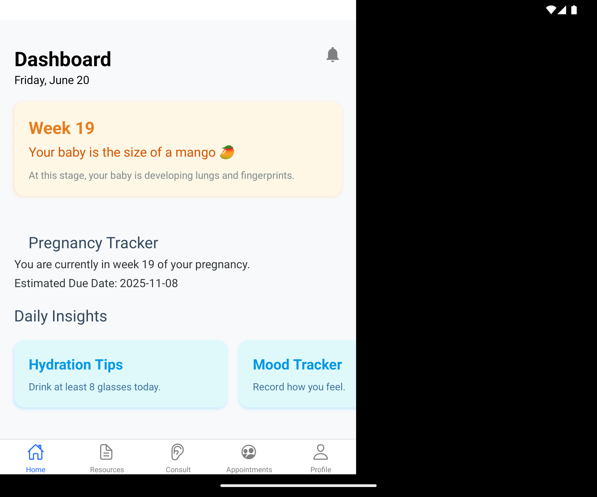
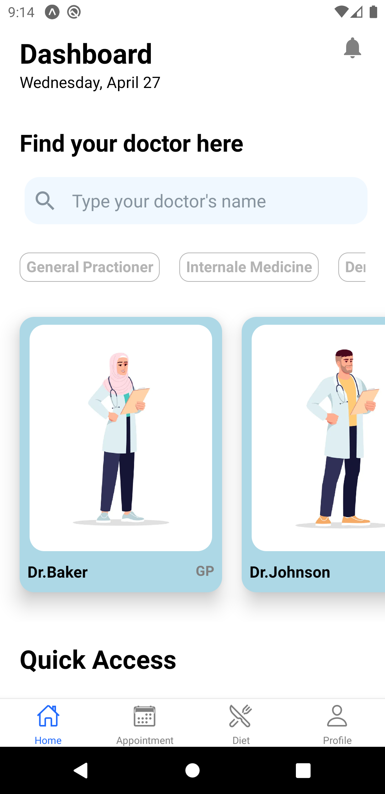
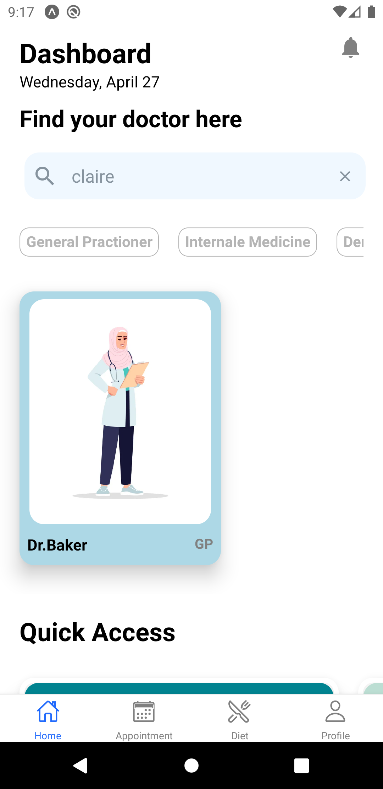
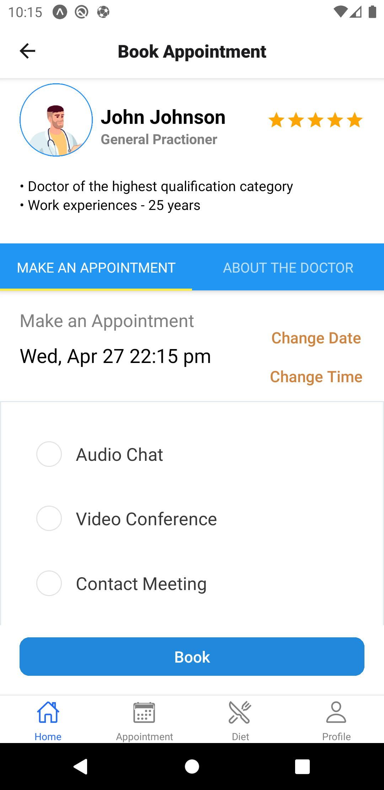
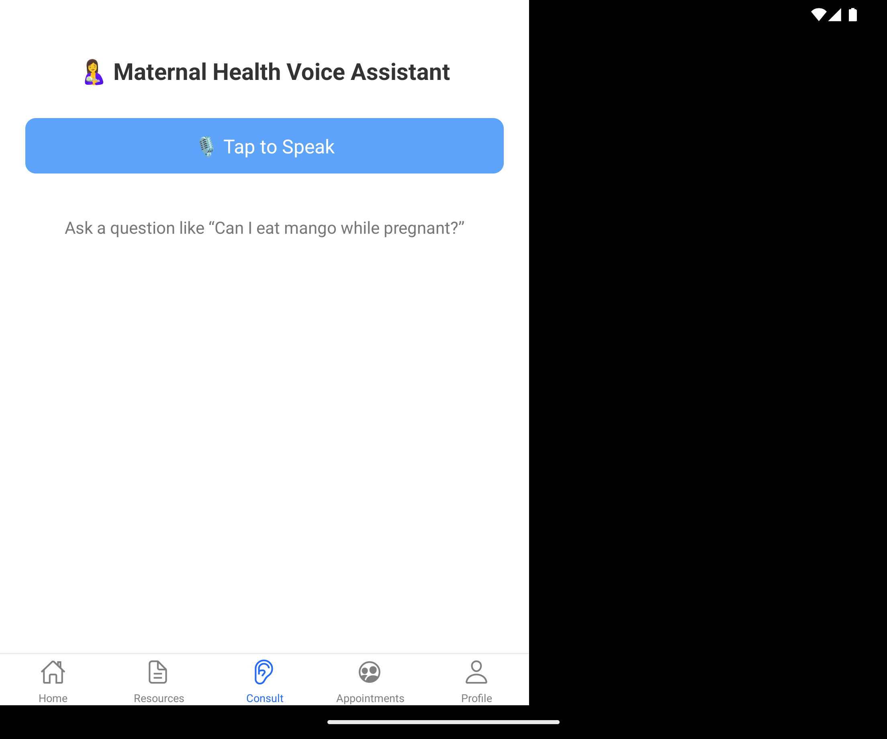
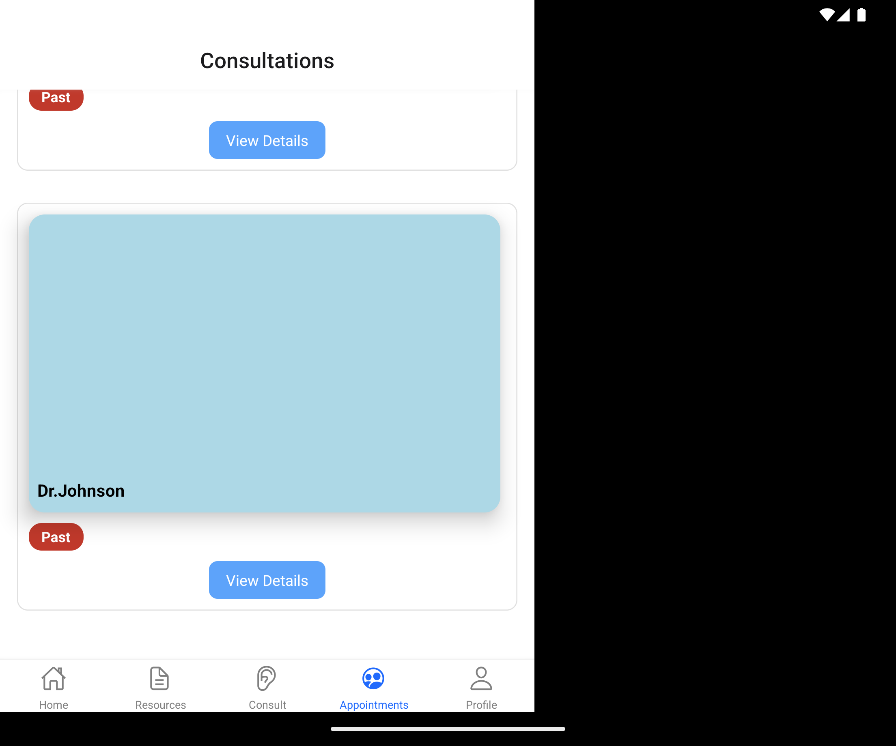
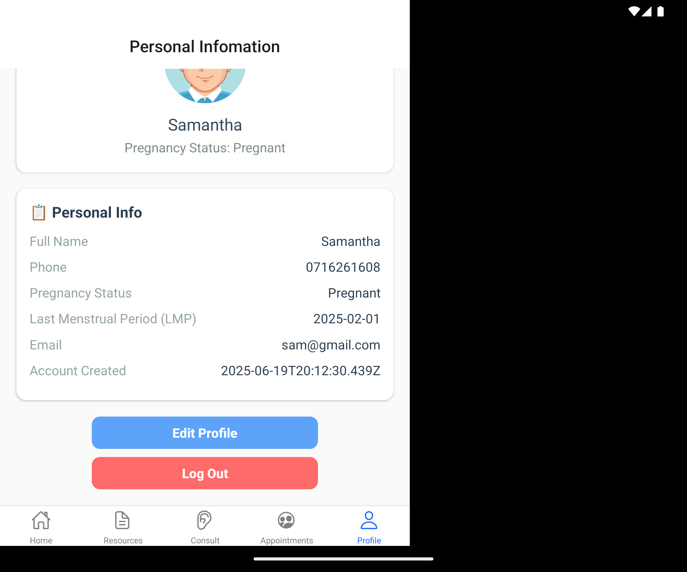

# Mzazi App - React Native

Mobile application project created with Expo, React Native, Firebase and some wonderful libraries for React Native application such as react-native-android-voice.

## Table of Contents

- [General Info](#general-info)
- [Main Features](#main-features)
- [Technologies](#technologies)
- [Quick Start](#quick-start)

## General Info

This Doctor Mobile application allows customers to create their account for health checking and book an appointment with their desired doctors.

### Register

<p flexDirection="row">

</p>

### Home Screen

<p flexDirection="row">



</p>

### Booking Screen

<p flexDirection="row">


</p>

### Resources

<p flexDirection="row">

</p>

### Voice Assistance

<p flexDirection="row">

</p>

### Consultations

<p flexDirection="row">

</p>

### Profile

<p flexDirection="row">

</p>
🚀 Mzazi App – Main Features

Mzazi is a smart healthcare and parental support app built with intuitive navigation and modern tools to simplify consultations and appointments.
🔐 Authentication & User Management

    Secure Firebase Authentication

    Email/password sign up, login, and logout

    Real-time session management

🧭 Navigation System

    Advanced navigation with:

        Tab Navigation

        Stack Navigation

        TabView for fluid screen switching

    Responsive UI optimized for mobile devices

🗓️ Doctor Search & Appointment Booking

    Search doctors by First Name or Last Name

    Book appointments with preferred time slot

    Choose from 3 meeting options:

        📞 Audio Chat

        🎥 Video Call

        🏥 In-Person Meeting

    View and manage bookings in the Appointments Screen

🧠 Smart Consultation Tools

    Speech-to-Text feature for voice-based consultation entry

    Date utilities to retrieve and format the current date automatically

## Main Features

- Complex navigation (Tab, Stack, TabView)
- Connect to Firebase (Authentication)
- Sign up credentials and login, sign out
- Get current date and date format
- Search doctor, filter by First Name and Last Name
- Book an appointment with the doctor by choosing time and select one meeting option. There are 3 options for meeting with the doctor: Audio Chat, Video Conference, Contact Meeting.
- Check the booking in the Appointment Screen
- Speech to Text tranlation for consultation

## Technologies

- Expo
- React Native
- React Native Elements
- React Native Vector Icons
- React Navigation V6
- React Native Community - datetimepicker V4
- Date-fns format
- Radio Button React Native V1
- Firebase Authentication V8
- Firebase Realtime Database
- React Native Android Voice
- React Native Text to Speech

## Quick Start

Here are some steps to run this project:

1. Clone the project

```
git@github.com:BiraiSamuel/mzazi.git
```

2. Download node_modules

```
npm install
```

3. Run Expo

```
expo start
```
